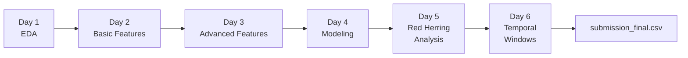

# 🏦 AML Mule Account Detection

> Anti-Money Laundering (AML) solution for identifying mule accounts in banking transaction data — built for the **IIT Delhi Phase 2 Challenge**.

[](https://python.org)
[](https://xgboost.readthedocs.io)
[](https://lightgbm.readthedocs.io)
[](https://pola.rs)

---

## 📋 Table of Contents

- [Problem Statement](#-problem-statement)
- [Project Structure](#-project-structure)
- [Data Overview](#-data-overview)
- [Pipeline Overview](#-pipeline-overview)
- [Feature Engineering](#-feature-engineering)
- [Modeling Approach](#-modeling-approach)
- [Red Herring Analysis](#-red-herring-analysis)
- [Temporal Window Detection](#-temporal-window-detection)
- [Results & Submission](#-results--submission)
- [Getting Started](#-getting-started)
- [Dependencies](#-dependencies)
- [Acknowledgements](#-acknowledgements)

---

## 🎯 Problem Statement

Identify **mule accounts** used for money laundering from banking transaction and account data. Given labelled training data (~96K accounts) and unlabelled test accounts (~64K), predict:

1. **`is_mule`** — Probability score (0–1) that an account is a mule
2. **`suspicious_start` / `suspicious_end`** — ISO timestamps of the suspected suspicious activity window

The challenge evaluates:

| Criteria | Weight |
|---|---|
| Model / Feature Ingenuity | 40% |
| Model Performance (AUC-ROC, F1) | 20% |
| Avoidance of Red Herrings | 15% |
| Temporal IoU & Additional Insights | 15% |
| Report Quality | 10% |

---

## 📁 Project Structure

```
IITD-Phase2/
├── data/                              # Raw data files (gitignored)
│   ├── accounts.parquet               # 160K account attributes
│   ├── accounts-additional.parquet    # Government scheme codes
│   ├── customers.parquet              # 159K customer demographics & KYC
│   ├── demographics.parquet           # Name, gender, address, phone
│   ├── branch.parquet                 # 9K branch metadata
│   ├── customer_account_linkage.parquet  # Customer ↔ Account mapping
│   ├── product_details.parquet        # Aggregated product holdings
│   ├── train_labels.parquet           # Training labels (is_mule)
│   ├── test_accounts.parquet          # 64K test account IDs
│   ├── transactions/                  # ~400M transactions (4 batches, 396 parts)
│   │   ├── batch-1/
│   │   ├── batch-2/
│   │   ├── batch-3/
│   │   └── batch-4/
│   ├── transactions_additional/       # Extended fields: geo, IP, balance (4 batches)
│   │   ├── batch-1/
│   │   ├── batch-2/
│   │   ├── batch-3/
│   │   └── batch-4/
│   └── README.md                      # Detailed data dictionary
│
├── notebooks/                         # Day-wise analysis notebooks
│   ├── Day1_exploration.ipynb         # EDA & data profiling
│   ├── Day2_features.ipynb            # Basic transaction features
│   ├── Day3_features.ipynb            # Advanced feature engineering
│   ├── Day4_modelling.ipynb           # Model training & ensemble
│   ├── Day5_RedHerring_Analysis.ipynb # Red herring detection
│   ├── Day6_Temporal_window_detection.ipynb  # Suspicious window estimation
│   └── final_model_clean.pkl          # Serialized final model
│
├── outputs/                           # Intermediate & final outputs (gitignored)
│   ├── features_txn_basic.parquet     # Basic transaction features
│   ├── features_txn_derived.parquet   # Derived transaction features
│   ├── features_account.parquet       # Account-level features
│   ├── features_customer.parquet      # Customer-level features
│   ├── features_branch.parquet        # Branch-level features
│   ├── features_burst.parquet         # Burst activity features
│   ├── features_entropy.parquet       # Network entropy features
│   ├── features_mcc.parquet           # MCC anomaly features
│   ├── features_contamination.parquet # Network contamination features
│   ├── features_passthrough.parquet   # Pass-through pattern features
│   ├── master_features_all.parquet    # All features merged (~80 cols)
│   ├── train_model_ready.parquet      # Final training matrix
│   ├── model_xgb_final.pkl            # Trained XGBoost model
│   ├── model_lgb_final.pkl            # Trained LightGBM model
│   ├── calibrator_final.pkl           # Probability calibrator
│   ├── oof_*.npy                      # Out-of-fold predictions
│   └── test_preds_*.npy               # Test set predictions
│
├── submission_final.csv               # Final submission file (64K predictions)
├── requirements.txt                   # Python dependencies
└── .gitignore
```

---

## 📊 Data Overview

The dataset comprises **16.2 GB** of banking data across **720 files**:

| Dataset | Scale | Description |
|---|---|---|
| **Transactions** | ~400M rows | 5-year window (Jul 2020 – Jun 2025), partitioned across 396 parts |
| **Accounts** | ~160K | Account attributes, balances, branch codes, KYC status |
| **Customers** | ~159K | Demographics, KYC documents, digital banking flags |
| **Train Labels** | ~96K | Binary mule labels with alert reasons & flag dates |
| **Test Accounts** | ~64K | Accounts to predict on |
| **Branches** | ~9K | Branch metadata (location, size, type) |

### Entity Relationships

```
customers ──(customer_id)──▶ customer_account_linkage ──(account_id)──▶ accounts
    │                                                                       │
    ▼                                                                       ▼
demographics, product_details                                   transactions ──▶ transactions_additional
                                                                    │
                                                              train_labels / test_accounts
                                                              accounts-additional
                                                              branch (via branch_code)
```

### Known Mule Behavior Patterns

The following money laundering patterns are encoded in the data and guide feature engineering:

1. **Dormant Activation** — Long-inactive accounts suddenly showing high-value bursts
2. **Structuring** — Repeated transactions just below reporting thresholds (~₹50,000)
3. **Rapid Pass-Through** — Large credits quickly followed by matching debits
4. **Fan-In / Fan-Out** — Many small inflows → one large outflow, or vice versa
5. **Geographic Anomaly** — Transactions inconsistent with account holder's location
6. **New Account High Value** — Recently opened accounts with unusually high volumes
7. **Round Amount Patterns** — Disproportionate use of exact round amounts
8. **Post-Mobile-Change Spike** — Transaction surge after mobile number update
9. **Branch-Level Collusion** — Clusters of suspicious accounts at the same branch
10. **MCC-Amount Anomaly** — Amounts that are statistical outliers for their merchant category
11. **Salary Cycle Exploitation** — Laundering disguised within salary/bill payment cycles
12. **Layered/Subtle** — Weak signals from multiple patterns combined

---

## 🔄 Pipeline Overview

The end-to-end pipeline follows a 6-day iterative development process:



---

## 🔧 Feature Engineering

Features are computed per `account_id` and saved as separate parquet files, then merged into `master_features_all.parquet` (~80 columns total).

### Basic Transaction Features (`Day2_features.ipynb`)

Computed by scanning all ~400M transactions in batches:

| Feature Group | Examples |
|---|---|
| **Volume & Counts** | `txn_count`, `credit_count`, `debit_count`, `net_flow` |
| **Amount Statistics** | `total_credit_amount`, `total_debit_amount`, `avg_txn_amount`, `max_txn_amount` |
| **Channel Usage** | `unique_channels`, `upi_credit_count`, `upi_debit_count`, `atm_count`, `imps_count` |
| **Temporal Span** | `first_txn_date`, `last_txn_date`, `active_days` |
| **Counterparty Network** | `unique_counterparties` |

### Derived Transaction Features

| Feature Group | Description |
|---|---|
| **Round Amount Ratio** | Proportion of transactions with round amounts (1K, 5K, 10K, 50K) |
| **High-Value Ratio** | Fraction of transactions above ₹50,000 threshold |
| **Credit-to-Debit Ratio** | Balance of inflows vs. outflows |
| **Night Transaction Ratio** | Transactions occurring between 11 PM – 5 AM |

### Account & Customer Features

| Feature Group | Description |
|---|---|
| **Account Age** | Days since account opening |
| **Balance Features** | Average, monthly, quarterly, and daily balances |
| **KYC Indicators** | PAN, Aadhaar, passport availability; KYC compliance |
| **Digital Flags** | Mobile banking, internet banking, ATM card, credit card flags |
| **Product Holdings** | Loan count/sum, credit card count, overdraft facilities |

### Advanced Features (`Day3_features.ipynb`)

| Feature | Description | Mule Signal |
|---|---|---|
| **MCC Z-Score** | Per-account deviation from global MCC-amount distribution | Anomalous spending patterns |
| **Counterparty Entropy** | Shannon entropy of counterparty distribution | Low entropy → concentrated network |
| **Burst Ratio** | Peak activity vs. baseline transaction rate | Dormant account activation |
| **Contamination Score** | Network proximity to known mule accounts | Shared counterparty networks |
| **Pass-Through Ratio** | Speed at which funds flow through the account | Rapid fund movement |
| **Branch Risk Features** | Branch-level mule density and relative risk | Collusion patterns |

---

## 🤖 Modeling Approach

### Architecture

The final model is a **calibrated ensemble** of two gradient boosting classifiers:

```
                    ┌──────────────┐
                    │  Feature     │
                    │  Matrix      │
                    │  (~80 cols)  │
                    └──────┬───────┘
                           │
              ┌────────────┼────────────┐
              ▼                         ▼
     ┌────────────────┐       ┌────────────────┐
     │    XGBoost     │       │   LightGBM     │
     │  n_est=500     │       │  n_est=500     │
     │  depth=6       │       │  depth=6       │
     │  lr=0.05       │       │  lr=0.05       │
     └────────┬───────┘       └────────┬───────┘
              │                        │
              ▼                        ▼
     ┌────────────────┐       ┌────────────────┐
     │  OOF Preds     │       │  OOF Preds     │
     └────────┬───────┘       └────────┬───────┘
              │                        │
              └──────────┬─────────────┘
                         ▼
                 ┌───────────────┐
                 │ Simple Average│
                 │   Ensemble    │
                 └───────┬───────┘
                         ▼
                 ┌───────────────┐
                 │  Probability  │
                 │  Calibration  │
                 └───────┬───────┘
                         ▼
                    Final Score
```

### Training Details

- **Cross-Validation**: 5-fold Stratified K-Fold
- **Class Imbalance**: `scale_pos_weight` (~35:1 ratio of legitimate to mule)
- **Early Stopping**: 50 rounds on validation AUC
- **Hyperparameters**: `subsample=0.8`, `colsample_bytree=0.8`, `reg_alpha=0.5`, `reg_lambda=1.0`
- **Calibration**: Post-hoc probability calibration for well-calibrated `is_mule` scores

### Data Leakage Prevention

Label-derived features that leak target information were identified and removed:

- `branch_mule_rate` — Directly computed from training labels
- `branch_relative_risk` — Derived from mule rate
- `mules_per_employee` — Leaks label information through branch

### Feature Importance

Top predictive features identified by the XGBoost model (saved to `outputs/feature_importance_xgb.png`):
- Transaction volume and amount statistics
- Burst ratio and temporal patterns
- MCC anomaly z-scores
- Counterparty entropy
- Network contamination scores

---

## 🎭 Red Herring Analysis

**Day 5** performs systematic detection of red herrings (misleading features planted in the data):

### Methodology

1. **Correlation Analysis** — Check feature correlations with the mule label; flag suspiciously high correlations
2. **Feature Variability Check** — Identify features with low unique values or high null rates
3. **Adversarial Validation** — Train a LightGBM classifier to distinguish train vs. test distributions
   - **Adversarial AUC = 0.345** (well below 0.5), confirming no significant train-test distribution shift

### Red Herring Candidates

Features flagged as potential red herrings include demographics-based features like:
- `days_since_address_update`
- `days_since_passbook_update`
- Gender and name-based features

These were either downweighted or excluded from the final model to avoid overfitting to noise.

---

## ⏱ Temporal Window Detection

**Day 6** estimates the suspicious activity window (`suspicious_start`, `suspicious_end`) for accounts predicted as mules:

### Approach

1. **Identify High-Risk Accounts** — Select accounts with `is_mule` probability above a threshold
2. **Extract Transaction History** — Pull full transaction records for ~1,700 high-risk accounts
3. **Anomaly Window Detection** — Analyze transaction patterns to identify the period of suspicious activity using:
   - Transaction velocity changes (sudden increase in frequency)
   - Amount distribution shifts (deviation from baseline)
   - Channel usage anomalies
4. **Output** — ISO timestamps for the estimated suspicious activity window

The temporal window accuracy is scored using **Temporal IoU** (Intersection over Union) against ground truth.

---

## 📈 Results & Submission

The final submission (`submission_final.csv`) contains **64,062 predictions**:

```csv
account_id,is_mule,suspicious_start,suspicious_end
ACCT_000005,0.049987,,
ACCT_000007,0.007515,,
ACCT_000009,0.009779,,
...
```

- **Format**: One row per test account with mule probability and optional temporal window
- **Primary Metric**: AUC-ROC on `is_mule` probability scores
- **Secondary Metric**: Temporal IoU for suspicious windows

---

## 🚀 Getting Started

### Prerequisites

- Python 3.10+
- ~20 GB free disk space (for data + outputs)

### Setup

```bash
# Clone the repository
git clone <repository-url>
cd IITD-Phase2

# Create virtual environment
python -m venv venv
source venv/bin/activate

# Install dependencies
pip install -r requirements.txt
```

### Running the Pipeline

Execute the notebooks sequentially in order:

```bash
# Launch Jupyter
jupyter notebook
```

| Step | Notebook | Description | Estimated Time |
|---|---|---|---|
| 1 | `Day1_exploration.ipynb` | Data exploration and profiling | ~5 min |
| 2 | `Day2_features.ipynb` | Basic transaction feature extraction | ~30-60 min |
| 3 | `Day3_features.ipynb` | Advanced feature engineering (MCC, entropy, burst) | ~30-60 min |
| 4 | `Day4_modelling.ipynb` | Model training, ensemble, and calibration | ~15-30 min |
| 5 | `Day5_RedHerring_Analysis.ipynb` | Red herring detection and feature cleaning | ~5 min |
| 6 | `Day6_Temporal_window_detection.ipynb` | Suspicious window estimation | ~20-40 min |

> **Note**: Steps 2 and 3 involve scanning ~400M transactions and can be memory-intensive. A machine with **16+ GB RAM** is recommended.

---

## 📦 Dependencies

Key libraries used:

| Library | Version | Purpose |
|---|---|---|
| `polars` | 1.38.1 | High-performance data processing |
| `pandas` | 3.0.1 | Data manipulation & model interfaces |
| `xgboost` | 3.2.0 | Gradient boosting classifier |
| `lightgbm` | 4.6.0 | Gradient boosting classifier |
| `scikit-learn` | 1.8.0 | Cross-validation, metrics, calibration |
| `matplotlib` | 3.10.8 | Visualization |
| `seaborn` | 0.13.2 | Statistical visualization |
| `numpy` | 2.4.2 | Numerical operations |
| `pyarrow` | 23.0.1 | Parquet file I/O |

See [`requirements.txt`](requirements.txt) for the complete list.

---

## 🙏 Acknowledgements

- **IIT Delhi** — For organizing the AML challenge
- **Data Source** — Synthetic banking data modeled on real-world money laundering patterns
- **Libraries** — Polars, XGBoost, LightGBM, and the broader Python ML ecosystem

---

<p align="center">
  <i>Built with 🧠 for the IIT Delhi Phase 2 AML Challenge</i>
</p>
